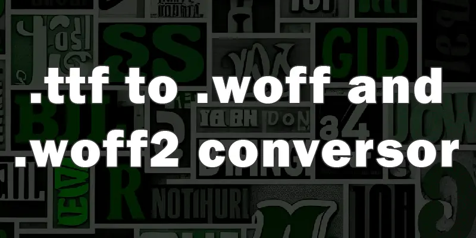

 
<h1 align="center"> Conversor de fuentes .ttf a woff y woff2
</h1>
 
 

 

  
### Diferencias entre WOFF y WOFF2
  
| Aspecto | WOFF | WOFF2 |  
| --- | --- | --- |
| Compresión | Basado en gzip | Algoritmo Brotli (más eficiente). |  
| Tamaño del archivo | Mayor en comparación | Más pequeño (hasta un 30% menos). |  
| Compatibilidad | Navegadores modernos y antiguos | Solo navegadores modernos. |  

 
 

Por qué usar **WOFF/WOFF2** en la web
Optimización para la Web: Estos formatos están diseñados para ser ligeros y rápidos de cargar, ideales para mejorar la velocidad de los sitios web.

**Licencias**: Permiten a los diseñadores incluir fuentes personalizadas respetando las restricciones de licencia, ya que los metadatos pueden contener esta información.

**Amplio soporte**: WOFF tiene soporte en navegadores

🛠 <b>Framework</b>: Next.js (utiliza la librería React)   
🎨<b>Estilo</b>: Tailwind CSS v4.0 y CSS puro para el UI de carga.  
📧<b>Dependencias de Nodejs</b>: ttf2woff y wawoff2  
💾<b>Deployed</b>: Vercel desde GitHub  

[Link a la web de mi app](https://woff-converter.vercel.app/)
